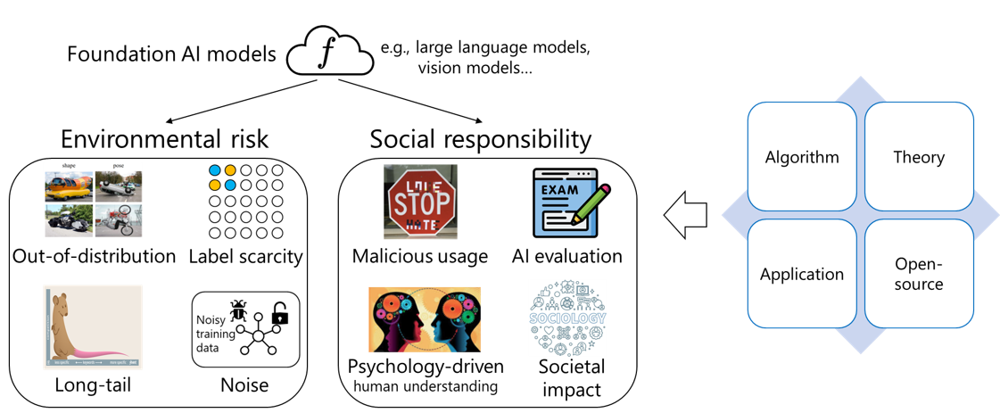

The long-term research goal is to build understand, evaluate, and enhance modern AI models, such as pre-trained and large foundation models. We create new theory, algorithms, applications, and open-sourced library to achieve our goal.
- Machine learning: I'm generally interested in designing algorithms and applications to make machine learning systems more robust, trustworthy, and responsible. Related topics include: machine learning with foundation models, robust machine learning, OOD / domain generalization, transfer learning, semi-supervised learning, federated learning, and related applications.
- Large language models: We mainly focus on understanding the potential and limitation of large foundation models. Related topics: LLM [evaluation](https://llm-eval.github.io/) and [enhancement](https://llm-enhance.github.io/).
- AI for social sciences: How to measure the impact of generative AI on different domains? How to assist interdisciplinary domains using powerful AI models? How to use existing social science knowledge to help us better understand AI behaviors?

Our research consists of the following topics with selected publications: [[View by year](https://jd92.wang/publications/)] [[Google scholar](https://scholar.google.com/citations?user=hBZ_tKsAAAAJ)]

##### Foundation model understanding

- **[ICML'24]** [Dynamic Evaluation of Large Language Models by Meta Probing Agents](https://arxiv.org/abs/2402.14865). Kaijie Zhu, Jindong Wang, Qinlin Zhao, Ruochen Xu, Xing Xie.
- **[ICML'24]** [Trustllm: Trustworthiness in large language models](https://arxiv.org/abs/2401.05561). Lichao Sun, Yue Huang, Haoran Wang, Siyuan Wu, Qihui Zhang, Chujie Gao, Yixin Huang, Wenhan Lyu, Yixuan Zhang, Xiner Li, and others.
- **[ACL'24 main]** [KIEval: A Knowledge-grounded Interactive Evaluation Framework for Large Language Models](https://arxiv.org/abs/2402.15043). Zhuohao Yu, Chang Gao, Wenjin Yao, Yidong Wang, Wei Ye, Jindong Wang , Xing Xie, Yue Zhang, and Shikun Zhang.
- **[ICLR'24 spotlight]** [DyVal: Graph-informed Dynamic Evaluation of Large Language Models](https://arxiv.org/abs/2309.17167). Kaijie Zhu, Jiaao Chen, Jindong Wang, Neil Zhenqiang Gong, Diyi Yang, Xing Xie.
- **[ICLR'24]** [PandaLM: An Automatic Evaluation Benchmark for LLM Instruction Tuning Optimization](https://arxiv.org/abs/2306.05087). Yidong Wang, Zhuohao Yu, Zhengran Zeng, Linyi Yang, Cunxiang Wang, Hao Chen, Chaoya Jiang, Rui Xie, Jindong Wang, Xing Xie, Wei Ye, Shikun Zhang, Yue Zhang. [[code](https://github.com/WeOpenML/PandaLM)]
- **[ICML'24]** [CompeteAI: Understanding the Competition Behaviors in Large Language Model-based Agents](https://arxiv.org/abs/2310.17512). Qinlin Zhao, Jindong Wang, Yixuan Zhang, Yiqiao Jin, Kaijie Zhu, Hao Chen, Xing Xie.
- [arXiv'23] [Meta Semantic Template for Evaluation of Large Language Models](https://arxiv.org/abs/2310.01448). Yachuan Liu, Liang Chen, Jindong Wang, Qiaozhu Mei, Xing Xie.
- **[ACM TIST'24]** [A Survey on Evaluation of Large Language Models](https://arxiv.org/abs/2307.03109). Yupeng Chang, Xu Wang, Jindong Wang, Yuan Wu, Kaijie Zhu, Hao Chen, Linyi Yang, Xiaoyuan Yi, Cunxiang Wang, Yidong Wang, Wei Ye, Yue Zhang, Yi Chang, Philip S. Yu, Qiang Yang, Xing Xie. [[code](https://github.com/MLGroupJLU/LLM-eval-survey)]
- [arXiv'23] [PromptRobust: Towards Evaluating the Robustness of Large Language Models on Adversarial Prompts](https://arxiv.org/abs/2306.04528). Kaijie Zhu, Jindong Wang, Jiaheng Zhou, Zichen Wang, Hao Chen, Yidong Wang, Linyi Yang, Wei Ye, Neil Zhenqiang Gong, Yue Zhang, Xing Xie. [[code](https://github.com/microsoft/promptbench)]
- **[ACL'23 findings]** [GLUE-X: Evaluating Natural Language Understanding Models from an Out-of-distribution Generalization Perspective](https://arxiv.org/abs/2211.08073). Linyi Yang, Shuibai Zhang, Libo Qin, Yafu Li, Yidong Wang, Hanmeng Liu, Jindong Wang, Xing Xie, Yue Zhang.
- **[ICLR'23 large model workshop]** [On the Robustness of ChatGPT: An Adversarial and Out-of-distribution Perspective](https://arxiv.org/abs/2302.12095). Jindong Wang, Xixu Hu, Wenxin Hou, Hao Chen, Runkai Zheng, Yidong Wang, Linyi Yang, Haojun Huang, Wei Ye, Xiubo Geng, Binxin Jiao, Yue Zhang, and Xing Xie.

##### Machine learning and large foundation models

- [arXiv'24] [Slight Corruption in Pre-training Data Makes Better Diffusion Models](https://arxiv.org/abs/2405.20494). Hao Chen, Yujin Han, Diganta Misra, Xiang Li, Kai Hu, Difan Zou, Masashi Sugiyama, Jindong Wang, Bhiksha Raj.
- [arXiv'24] [On Catastrophic Inheritance of Large Foundation Models](https://arxiv.org/abs/2402.01909). Hao Chen, Bhiksha Raj, Xing Xie, Jindong Wang.
- **[ICML'24]** [Open-Vocabulary Calibration for Vision-Language Models](https://arxiv.org/abs/2402.04655). Shuoyuan Wang, Jindong Wang , Guoqing Wang, Bob Zhang, Kaiyang Zhou, and Hongxin Wei.
- **[ACL'24 main]** [Detoxifying Large Language Models via Knowledge Editing](https://arxiv.org/abs/2403.14472). Mengru Wang, Ningyu Zhang, Ziwen Xu, Zekun Xi, Shumin Deng, Yunzhi Yao, Qishen Zhang, Linyi Yang, Jindong Wang , and Huajun Chen.
- **[ICLR'24 spotlight]** [Understanding and Mitigating the Label Noise in Pre-training on Downstream Tasks](https://arxiv.org/abs/2309.17002). Hao Chen, Jindong Wang, Ankit Shah, Ran Tao, Hongxin Wei, Xing Xie, Masashi Sugiyama, Bhiksha Raj.
- **[ICLR'24]** [Supervised Knowledge Makes Large Language Models Better In-context Learners](https://arxiv.org/abs/2312.15918). Linyi Yang, Shuibai Zhang, Zhuohao Yu, Guangsheng Bao, Yidong Wang, Jindong Wang, Ruochen Xu, Wei Ye, Xing Xie, Weizhu Chen, Yue Zhang. 
- [arXiv'23] [ZooPFL: Exploring Black-box Foundation Models for Personalized Federated Learning](https://arxiv.org/abs/2310.05143). Wang Lu, Hao Yu, Jindong Wang, Damien Teney, Haohan Wang, Yiqiang Chen, Qiang Yang, Xing Xie, Xiangyang Ji.
- [**IJCV'23**] [Exploring Vision-Language Models for Imbalanced Learning](https://arxiv.org/abs/2304.01457). Yidong Wang, Zhuohao Yu, Jindong Wang, Qiang Heng, Hao Chen, Wei Ye, Rui Xie, Xing Xie, Shikun Zhang. [[code](https://github.com/Imbalance-VLM/Imbalance-VLM)]
- **[IEEE Data Engineering Bulletin'23]** FedCLIP: Fast Generalization and Personalization for CLIP in Federated Learning. Wang Lu, Xixu Hu, Jindong Wang, Xing Xie. [[arxiv](https://arxiv.org/abs/2302.13485)]

Open source:
  - [Project SearchAnything](https://github.com/Immortalise/SearchAnything): semantic local search.

AI for social sciences:
- [arXiv'24] [CulturePark: Boosting Cross-cultural Understanding in Large Language Models](https://arxiv.org/abs/2405.15145). Cheng Li, Damien Teney, Linyi Yang, Qingsong Wen, Xing Xie, Jindong Wang.
- **[ICML'24 Oral]** [Competeai: Understanding the competition behaviors in large language model-based agents](https://arxiv.org/abs/2310.17512). Qinlin Zhao, Jindong Wang, Yixuan Zhang, Yiqiao Jin, Kaijie Zhu, Hao Chen, and Xing Xie.
- **[ICML'24]** [The good, the bad, and why: Unveiling emotions in generative ai](https://arxiv.org/abs/2312.11111). Cheng Li, Jindong Wang, Yixuan Zhang, Kaijie Zhu, Xinyi Wang, Wenxin Hou, Jianxun Lian, Fang Luo, Qiang Yang, and Xing Xie.
- **[IJCAI'24]** [NegativePrompt: Leveraging Psychology for Large Language Models Enhancement via Negative Emotional Stimuli](https://arxiv.org/abs/2405.02814). Xu Wang, Cheng Li, Yi Chang, Jindong Wang , and Yuan Wu.
- **[ACL'24]** [MM-Soc: Benchmarking Multimodal Large Language Models in Social Media Platforms](https://arxiv.org/abs/2402.14154). Yiqiao Jin, Minje Choi, Gaurav Verma, Jindong Wang , and Srijan Kumar.
- [arXiv'24] [CultureLLM: Incorporating Cultural Differences into Large Language Models](https://arxiv.org/abs/2402.10946). Cheng Li, Mengzhou Chen, Jindong Wang, Sunayana Sitaram, Xing Xie.
- [arXiv'24] [AgentReview: Exploring Peer Review Dynamics with LLM Agents](https://arxiv.org/abs/2406.12708). Yiqiao Jin, Qinlin Zhao, Yiyang Wang, Hao Chen, Kaijie Zhu, Yijia Xiao, Jindong Wang.
- [arXiv'23] [EmotionPrompt: Leveraging Psychology for Large Language Models Enhancement via Emotional Stimulus](https://arxiv.org/abs/2307.11760). Cheng Li, Jindong Wang, Kaijie Zhu, Yixuan Zhang, Wenxin Hou, Jianxun Lian, Xing Xie.

##### Out-of-distribution (Domain) generalization and general machine learning

- **[ICML'24]** [Selective mixup helps with distribution shifts, but not (only) because of mixup](https://arxiv.org/abs/2305.16817). Damien Teney, Jindong Wang, and Ehsan Abbasnejad.
- **[IEEE TPAMI'24]** [DIVERSIFY: A General Framework for Time Series Out-of-distribution Detection and Generalization](https://arxiv.org/abs/2308.02282). Wang Lu, Jindong Wang, Xinwei Sun, Yiqiang Chen, Xiangyang Ji, Qiang Yang, Xing Xie.
- **[IEEE VR 24]** Generating Virtual Reality Interaction Data from Out-of-Distribution Desktop Data: An Exploration Using Stroke Gestures. Linping Yuan, Boyu Li, Jindong Wang, Huaming Qu, Wei Zeng.
- **[UbiComp'24]** [Optimization-Free Test-Time Adaptation for Cross-Person Activity Recognition](https://arxiv.org/abs/2310.18562). Shuoyuan Wang, Jindong Wang, HuaJun Xi, Bob Zhang, Lei Zhang, Hongxin Wei.
- **[CPAL'24]** [Optimization-Free Test-Time Adaptation for Cross-Person Activity Recognition](https://arxiv.org/abs/2310.18562). Shuoyuan Wang, Jindong Wang , Huajun Xi, Bob Zhang, Lei Zhang, and Hongxin Wei.
- **[TNNLS'24]** UP-Net: An Uncertainty-Driven Prototypical Network for Few-Shot Fault Diagnosis. Ge Yu, Jindong Wang, Jinhai Liu, Xi Zhang, Yiqiang Chen, and Xing Xie.
- **[NeurIPS'23]** [Distilling Out-of-Distribution Robustness from Vision-Language Foundation Models](https://arxiv.org/abs/2311.01441). Andy Zhou, Jindong Wang, Yu-Xiong Wang, Haohan Wang.
- **[ICCV'23]** Improving Generalization of Adversarial Training via Robust Critical Fine-Tuning. Kaijie Zhu, Xixu Hu, Jindong Wang, Xing Xie, Ge Yang.
- **[ICLR'23]** [Out-of-distribution Representation Learning for Time Series Classification](https://arxiv.org/abs/2209.07027). Wang Lu, Jindong Wang, Xinwei Sun, Yiqiang Chen, and Xing Xie.
- **[KDD'23]** [Domain-Specific Risk Minimization for Out-of-Distribution Generalization](https://arxiv.org/pdf/2208.08661.pdf). YiFan Zhang, Jindong Wang, Jian Liang, Zhang Zhang, Baosheng Yu, Liang Wang, Xing Xie, and Dacheng Tao.
- **[KDD'23]** [Generalizable Low-Resource Activity Recognition with Diverse and Discriminative Representation Learning](ddd). Xin Qin, Jindong Wang, Shuo Ma, Wang Lu, Yongchun Zhu, Xing Xie, Yiqiang Chen.
- **[ACL'23 findings]** [GLUE-X: Evaluating Natural Language Understanding Models from an Out-of-distribution Generalization Perspective](https://arxiv.org/abs/2211.08073). Linyi Yang, Shuibai Zhang, Libo Qin, Yafu Li, Yidong Wang, Hanmeng Liu, Jindong Wang, Xing Xie, Yue Zhang.
- **[KDD'23 workshop]** [Towards Optimization and Model Selection for Domain Generalization: A Mixup-guided Solution](https://arxiv.org/abs/2209.00652). Wang Lu, Jindong Wang, Yidong Wang, Kan Ren, Yiqiang Chen, Xing Xie.
- **[TKDE'22]** [Generalizing to Unseen Domains: A Survey on Domain Generalization](https://arxiv.org/abs/2103.03097). Jindong Wang, Cuiling Lan, Chang Liu, Yidong Ouyang, Tao Qin, Wang Lu, Yiqiang Chen, Wenjun Zeng, and Philip S. Yu.
- **[TMLR'22]** [Domain-invariant Feature Exploration for Domain Generalization](https://arxiv.org/abs/2207.12020). Wang Lu, Jindong Wang, Haoliang Li, Yiqiang Chen, and Xing Xie.
- **[UbiComp'22]** [Semantic-Discriminative Mixup for Generalizable Sensor-based Cross-domain Activity Recognition](http://arxiv.org/abs/2206.06629). Wang Lu, Jindong Wang, Yiqiang Chen, Sinno Pan, Chunyu Hu, and Xin Qin.
- **[NeurIPS'21]** [Learning causal semantic representation for out-of-distribution prediction](https://arxiv.org/abs/2011.01681). Chang Liu, Xinwei Sun, Jindong Wang , Haoyue Tang, Tao Li, Tao Qin, Wei Chen, and Tie-Yan Liu.
- **[CIKM'21]** [Adarnn: Adaptive learning and forecasting of time series](https://arxiv.org/abs/2108.04443). Yuntao Du, Jindong Wang, Wenjie Feng, Sinno Pan, Tao Qin, Renjun Xu, and Chongjun Wang.
- **[TNNLS'20, 400 + citations]** [Deep subdomain adaptation network for image classification](https://ieeexplore.ieee.org/document/9085896). Yongchun Zhu, Fuzhen Zhuang, Jindong Wang, Guolin Ke, Jingwu Chen, Jiang Bian, Hui Xiong, and Qing He.
- **[ACMMM'18, 500+ citations]** [Visual domain adaptation with manifold embedded distribution alignment](https://jd92.wang/assets/files/a11_mm18.pdf). Jindong Wang, Wenjie Feng, Yiqiang Chen, Han Yu, Meiyu Huang, and Philip S Yu.
- **[ICDM'17, 500+ citations]** [Balanced distribution adaptation for transfer learning](http://ieeexplore.ieee.org/document/8215613/?part=1). Jindong Wang, Yiqiang Chen, Shuji Hao, Wenjie Feng, and Zhiqi Shen.
- Open-source: 
  - [Transfer learning](https://github.com/jindongwang/transferlearning) 
  - robustlearn: A unified repo for robust machine learning, such as OOD and adversarial robustness: [robustlearn](https://github.com/microsoft/robustlearn) 
  - PandaLM: [PandaLM](https://github.com/WeOpenML/PandaLM) 

##### Semi-supervised learning for low-resource learning

- **[ICML'24]** [A General Framework for Learning from Weak Supervision](https://arxiv.org/abs/2402.01922). Hao Chen, Jindong Wang, Lei Feng, Xiang Li, Yidong Wang, Xing Xie, Masashi Sugiyama, Rita Singh, and Bhiksha Raj.
- **[ICLR'23]** [FreeMatch: Self-adaptive Thresholding for Semi-supervised Learning](https://arxiv.org/abs/2205.07246). Yidong Wang, Hao Chen, Qiang Heng, Wenxin Hou, Yue Fan, Zhen Wu, Jindong Wang, Marios Savvides, Takahiro Shinozaki, Bhiksha Raj, Bernt Schiele, and Xing Xie.
- **[ICLR'23]** [SoftMatch: Addressing the Quantity-Quality Tradeoff in Semi-supervised Learning](https://arxiv.org/abs/2301.10921). Hao Chen, Ran Tao, Yue Fan, Yidong Wang, Jindong Wang, Bernt Schiele, Xing Xie, Bhiksha Raj, and Marios Savvides.
- **[NeurIPS'22]** [USB: A Unified Semi-supervised Learning Benchmark](https://arxiv.org/abs/2208.07204). Yidong Wang, Hao Chen, Yue Fan, Wang Sun, Ran Tao, Wenxin Hou, Renjie Wang, Linyi Yang, Zhi Zhou, Lan-Zhe Guo, Heli Qi, Zhen Wu, Yu-Feng Li, Satoshi Nakamura, Wei Ye, Marios Savvides, Bhiksha Raj, Takahiro Shinozaki, Bernt Schiele, Jindong Wang, Xing Xie, and Yue Zhang.
- **[TASLP'22]** [Exploiting Adapters for Cross-lingual Low-resource Speech Recognition](https://arxiv.org/abs/2105.11905). Wenxin Hou, Han Zhu, Yidong Wang, Jindong Wang, Tao Qin, Renjun Xu, and Takahiro Shinozaki.
- **[NeurIPS'21, 700+ citations]** [Flexmatch: Boosting semi-supervised learning with curriculum pseudo labeling](https://arxiv.org/abs/2110.08263). Bowen Zhang, Yidong Wang, Wenxin Hou, Hao Wu, Jindong Wang, Manabu Okumura, and Takahiro Shinozaki.
- Open-source:
  - USB: A unified semi-supervised learning toolbox for CV, NLP, and Audio: [USB](https://github.com/microsoft/Semi-supervised-learning) 
  - A unified Pytorch-based semi-supervised learning library: **[TorchSSL](https://github.com/TorchSSL/TorchSSL) 

##### Safe transfer learning for security
- **[ECCV'24]** [SpecFormer: Guarding Vision Transformer Robustness via Maximum Singular Value Penalization](https://arxiv.org/abs/2402.03317). Xixu Hu, Runkai Zheng, Jindong Wang, Cheuk Hang Leung, Qi Wu, Xing Xie.
- **[TNNLS'23]** [MetaFed: Federated Learning among Federations with Cyclic Knowledge Distillation for Personalized Healthcare](https://arxiv.org/pdf/2206.08516.pdf). Yiqiang Chen, Wang Lu, Xin Qin, Jindong Wang , and Xing Xie. 
- **[ICSE'22]** [ReMoS: Reducing Defect Inheritance in Transfer Learning via Relevant Model Slicing](https://jd92.wang/assets/files/icse22-remos.pdf). Ziqi Zhang, Yuanchun Li, Jindong Wang, Bingyan Liu, Ding Li, Xiangqun Chen, Yao Guo, and Yunxin Liu.
- **[IEEE Data Engineering Bulletin'23]** FedCLIP: Fast Generalization and Personalization for CLIP in Federated Learning. Wang Lu, Xixu Hu, Jindong Wang, Xing Xie. [[arxiv](https://arxiv.org/abs/2302.13485)]
- **[IEEE TBD'22]** [Personalized Federated Learning with Adaptive Batchnorm for Healthcare](https://arxiv.org/abs/2112.00734). Wang Lu, Jindong Wang, Yiqiang Chen, Xin Qin, Renjun Xu, Dimitrios Dimitriadis, and Tao Qin.
- **[TKDE'22]** [Unsupervised deep anomaly detection for multi-sensor time-series signals](https://arxiv.org/abs/2107.12626). Yuxin Zhang, Yiqiang Chen, Jindong Wang, and Zhiwen Pan.
- **[IntSys'22, 800+ citations]** [Fedhealth: A federated transfer learning framework for wearable healthcare](https://ieeexplore.ieee.org/document/9076082). Yiqiang Chen, Xin Qin, Jindong Wang, Chaohui Yu, and Wen Gao. 
- Open-source:
  - PersonalizedFL: a personalized federated learning libraty: [PersonalizedFL](https://github.com/microsoft/PersonalizedFL) 
  - robustlearn: A unified repo for robust machine learning, such as OOD and adversarial robustness: [robustlearn](https://github.com/microsoft/robustlearn) 

##### Imbalanced learning for long-tailed tasks

- **[arXiv'23]** [Exploring Vision-Language Models for Imbalanced Learning](https://arxiv.org/abs/2304.01457). Yidong Wang, Zhuohao Yu, Jindong Wang, Qiang Heng, Hao Chen, Wei Ye, Rui Xie, Xing Xie, Shikun Zhang.
- **[ACML'22]** [Margin Calibration for Long-Tailed Visual Recognition](https://arxiv.org/abs/2112.07225). Yidong Wang, Bowen Zhang, Wenxin Hou, Zhen Wu, Jindong Wang, and Takahiro Shinozaki.
- Open-source:
  - Imbalance-VLM: a library for imbalanced learning in vision-language models. [[Imbalance-VLM](https://github.com/Imbalance-VLM/Imbalance-VLM)]

##### Miscellaneous

1. An easy-to-use speech recognition toolkit based on Espnet: [EasyESPNet](https://github.com/jindongwang/EasyEspnet)
2. Leading the transfer learning tutorial (迁移学习简明手册) on Github:
                    [Tutorial](https://github.com/jindongwang/transferlearning-tutorial)
3. I'm also leading other popular research projects: [Machine learning](https://github.com/jindongwang/MachineLearning), [Activity recognition](https://github.com/jindongwang/activityrecognition)
4.  I started a software studio *Pivot Studio* and made many applications in 2010-2014:  [Our applications](https://v.youku.com/v_show/id_XNjI2Njg2MzAw.html?spm=a2hbt.13141534.1_2.d_1&scm=20140719.manual.114461.video_XNjI2Njg2MzAw)
